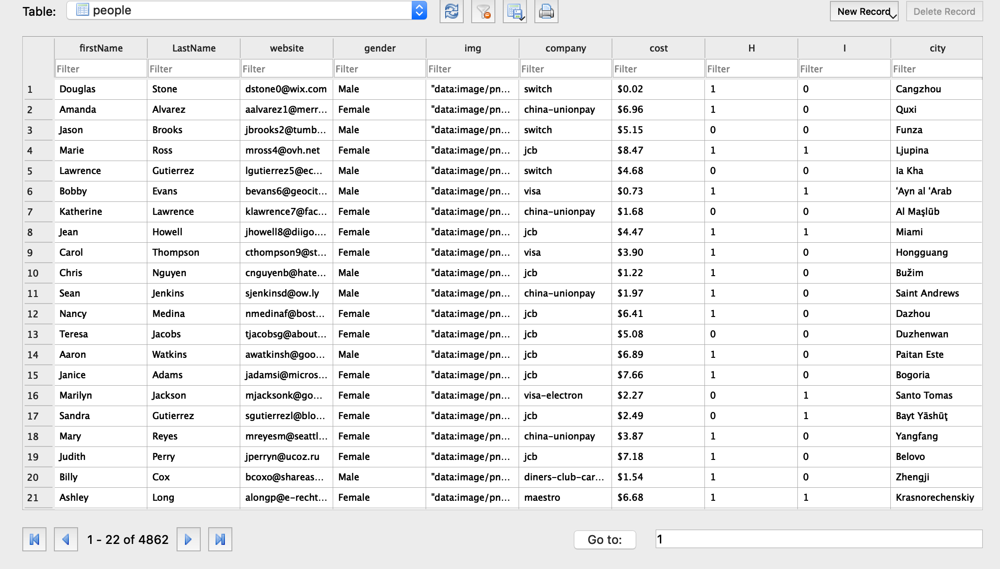

# MS3
## Description:
MS3 Programming Challenge
Data for the project is included in the sample CSV file, attached. Please create a Github or Bitbucket repository for the project and push all code there; please email the link to the repository when you submit your project.

Customer X just informed us that we need to churn out a code enhancement ASAP for a new project.  Here is what they need:

1. We need a Java application that will consume a CSV file, parse the data and insert to a SQLite In-Memory database.  
a. Table X has 10 columns A, B, C, D, E, F, G, H, I, J which correspond with the CSV file column header names.
b. Include all DDL in submitted repository
c. Create your own SQLite DB

2. The data sets can be extremely large so be sure the processing is optimized with efficiency in mind.  

3. Each record needs to be verified to contain the right number of data elements to match the columns.  
a. Records that do not match the column count must be written to the bad-data-<timestamp>.csv file
b. Elements with commas will be double quoted

4. At the end of the process write statistics to a log file
a. # of records received
b. # of records successful
c. # of records failed

## Result

## Challenges:
For this program, some of the most challenging aspect I had to face was working with SQLite in Java. I had worked with postgresql and never had to create a table. Therefore, this was new to me. In class we are given most of the file so I had to learned we have to download sqlite-jdbc-3.27.2.1(The version I download) in order to run SQLite in Java. However, some of the DDL were the same as postgresql.  Another challenge was learning java commands and syntax for functions that work with CSV files.

## Instructions:
You will need a SQLite-JDBC jar file to run the program:
This is where to download the version I am using https://bitbucket.org/xerial/sqlite-jdbc/downloads/
The next step is running the main function. I personally used intellij but eclipse can be use too. I used DB Browser for sqlite to view the database. It can be download at https://sqlitebrowser.org/

## Approach:
First, I looked at all the file I was given: The file was a csv that contains transaction for different people. I then look at different java functions that can parse csv files. I used them to extract the csv so each row was a long string entering at once. I notice each column were separated by commas so I used the comma to split the string. I created a function to check if all the column items were there. Then I created a different class to create the table and create an add function to insert into the table. Overall, I parsed the csv file to make sure I got the right output then create the database and insert the correct information. If I had more information and time, I would make the database unique and assign another attribute like unique ID.
